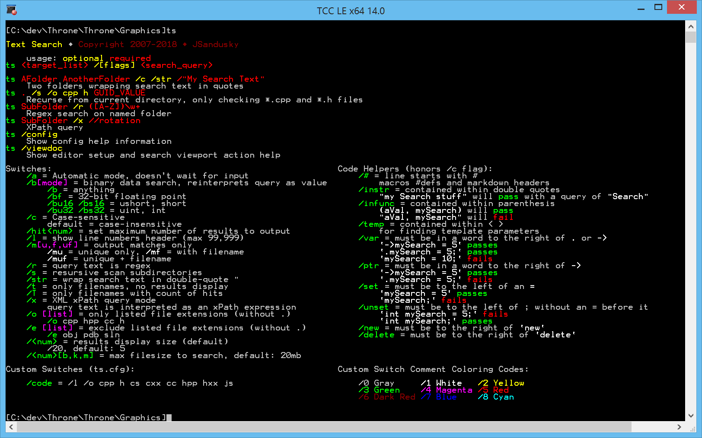

# TS

A windows console text search program similar to grep, but better. Scrolling search results and enough modes to forget about. Drop it in C:/Windows or put it on your PATH and just fire away a `ts` in the commandline for help.

TS is feature packed with programming specific switches such as `/var`, `/ptr`, `/instr` and `/infunc` as well as the capability to use a config file to add custom switches for commonly used regular expressions or combinations of flags.

    # standard code search custom flag
    /code = /l /o cpp hpp c h cxx hxx cs
    
TS also includes rudimentary binary file searching for reverse engineering or identifying offsets into blobs.
    

# TODO

- Add `/m` only show matching text, like grep -o
    - This is useful when building interop tables, such as grabbing everything that's `VAR_` to get `VAR_FLOAT, VAR_INT, etc`
    - `/mu` *match unique*
- Add `/hit<num>` only show `<num>` matches.
- Add support for explicitly named files instead of directories `ts MyFileName.bin /bu16 3338`
- Add json-query support
- Add RIFF container searching
    - Header and structure blocks only really
- Zip archive searching
    - Headers and records
